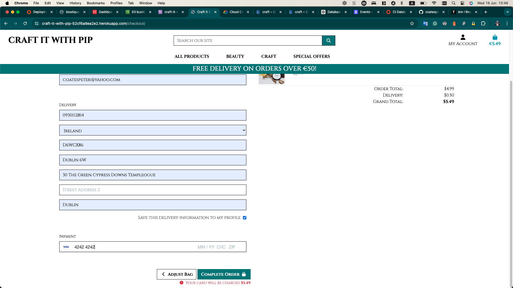

# Craft It With Pip

- Link to deployed site - [https://craft-it-with-pip-52cf6a8ea2e2.herokuapp.com/](https://craft-it-with-pip-52cf6a8ea2e2.herokuapp.com/)
- Link to GitHub repository - [https://github.com/coatespeter/craft-it-pp5](https://github.com/coatespeter/craft-it-pp5)

## Table of Contents

- [Craft It With Pip](#craft-it-with-pip)
  - [Table of Contents](#table-of-contents)
  - [Wireframes](#wireframes)
  - [Post and Comment Relationship Diagram](#post-and-comment-relationship-diagram)
  - [User Stories](#user-stories)
  - [Features](#features)
  - [Technologies Used](#technologies-used)
  - [Future Features](#future-features)
  - [Setting up Django](#setting-up-django)
  - [Deploying to Heroku](#deploying-to-heroku)
  - [Testing](#testing)
    - [Manual Testing](#manual-testing)
  - [Bugs](#bugs)
  - [Credits](#credits)
    - [Content](#content)
    - [Media](#media)
    - [Libraries \& Frameworks](#libraries--frameworks)
    - [Acknowledgements](#acknowledgements)

## Wireframes

- At the beginning of the project, I made up some rough wireframes to give me an idea of what I wanted the site to look like. I used draw.io to create these wireframes. I made a wireframe for the home page and the about page.

## Post and Comment Relationship Diagram

- Initial plan

## User Stories

- 

## Features

- 

- Navbar - 

- 

- Register Page

- Login Page

- Logout Page

- 

- Authentication for comments.

- Comments box

- 

- Contact admin form

- 

- 
![free shippping]media/freeshipping.png()

## Technologies Used

- HTML - The project uses HTML to create the structure of the site.
- CSS - The project uses CSS to style the site.
- JavaScript - JavaScript was used to link the buttons to functionality
- Python - The project uses Python to create the backend of the site.
- Django - The project uses Django as the web framework.
- Heroku - The project is deployed on Heroku.
- Git - The project uses Git for version control.
- GitHub - The project uses GitHub to store the code and to plan the project.
- Postgres - The project uses Postgres as the database.
- Bootstrap - The project uses Bootstrap to style the site.
- Google Fonts - The project uses Google Fonts to import the font used in the site.
- ElephantSQL - The project uses ElephantSQL to host the database.
- Draw.io - The project uses Draw.io to create the wireframe.
- Cloudinary - The project uses Cloudinary to host the images.

## Future Features

## Setting up Django

- Firstly, I installed all the relevant packages necessary for this site. These were, Django Gunicorn, Psycopg2, Django Heroku, Django Crispy Forms, Pillow, Cloudinary, DJ Database URL, and Whitenoise.
- I then created a new Django project and app.
- I migrated the database and created a superuser.
- I created a Procfile and a requirements.txt file.
- I created an admin account.
- I then created the models for the site and migrated the database again.
- I used Elephantsql to host the database and connected it to the site vis a newly created instance.
- I linked the database to the site using the DJ Database URL package.
- I then created the views and urls for the site.
- I then created the templates for the site.
- I then created the static files for the site.
- I then created the forms for the site.
- I logged into Heroku and created a new app. This app was linked via GitHub to my code base. I was able to deploy early on Heroku and keep an eye out for any bugs during the build process by redeploying the app and making sure everything was working as expected.
- I added the necessary config vars to Heroku to connect the database and the cloudinary image hosting.
  
## Deploying to Heroku

- Firstly, I created a new app on Heroku.
- I then connected the app to my GitHub repository.
- I then added the necessary config vars to Heroku to connect the database and the cloudinary image hosting.
- In the deploy section, I was able to manually deploy the app and keep an eye out for any bugs during the build process by redeploying the app and making sure everything was working as expected.

## Testing

### Manual Testing

## Bugs

- I encountered a but on deployment in which my static files were not being served. I had to add the Whitenoise package to my settings.py file to fix this issue.

- I encountered a bug in which the testimonial and faq were not working correctly due to migrations not being sent to Heroku. I fixed that particular issue by running the migrations on the Heroku CLI.

## Credits

### Content

- The content for this site was inspired by the Code Institute Django project "I think therefore I blog".
- I used some Django educational material for some help with the setup of a Django-based site. 
  

### Media

- The images used in this site were obtained from 
  
  .
- Font - The font I used called Natanael Gama One was obtained from 
  .

### Libraries & Frameworks

- The site uses the [Django web framework](https://www.djangoproject.com/).
- The site uses the [Bootstrap framework](https://getbootstrap.com/).

### Acknowledgements
