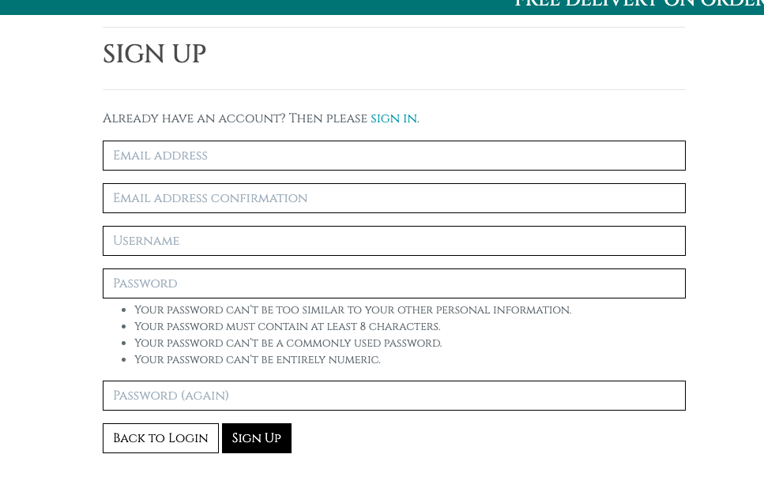
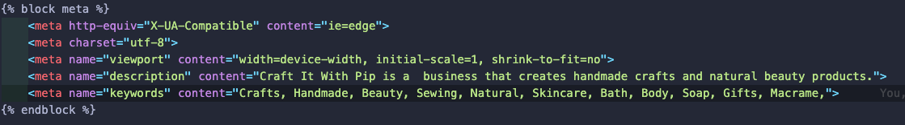

# Craft It With Pip

- Link to deployed site - [https://craft-it-with-pip-52cf6a8ea2e2.herokuapp.com/](https://craft-it-with-pip-52cf6a8ea2e2.herokuapp.com/)
- Link to GitHub repository - [https://github.com/coatespeter/craft-it-pp5](https://github.com/coatespeter/craft-it-pp5)

## Table of Contents

- [Craft It With Pip](#craft-it-with-pip)
  - [Table of Contents](#table-of-contents)
  - [Wireframes](#wireframes)
  - [Post and Comment Relationship Diagram](#post-and-comment-relationship-diagram)
  - [User Stories](#user-stories)
  - [Features](#features)
  - [Technologies Used](#technologies-used)
  - [Future Features](#future-features)
  - [Setting up Django](#setting-up-django)
  - [Deploying to Heroku](#deploying-to-heroku)
  - [Testing](#testing)
    - [Manual Testing](#manual-testing)
  - [Bugs](#bugs)
  - [Credits](#credits)
    - [Content](#content)
    - [Media](#media)
    - [SEO - Search Engine Optimization research](#seo---search-engine-optimization-research)
    - [Subscription](#subscription)
    - [Privacy Policy](#privacy-policy)
    - [Libraries \& Frameworks](#libraries--frameworks)
    - [Credits](#credits-1)
    - [Acknowledgements](#acknowledgements)

## Wireframes

- At the beginning of the project, I made up some rough wireframes to give me an idea of what I wanted the site to look like. I used draw.io to create these wireframes. I made a wireframe for the home page and the about page.

## Post and Comment Relationship Diagram

- Below is a relationship model for the custom models in the interactions app. The FAQ model, the Contact model, and the Testimonial model.

## User Stories

- As a user, I want to register an account so that I can make purchases and view my order history.
  
- As a registered user, I want to log in to my account so that I can access my profile and make purchases.

- As a logged-in user, I want to log out of my account so that my session is secure.

- As a logged-in user, I want to update my profile information so that my details are current.

- As a user, I want to navigate through the site using a navigation bar so that I can find products easily.

- As a user, I want to browse and view products so that I can choose items to purchase.

- As a user, I want to add products to my cart so that I can purchase them later.

- As a user, I want to purchase products in my cart so that I can receive the items.

- As a logged-in user, I want to see my order history so that I can track my purchases.

- As a site owner, I want to log in as a super user so that I can manage the site.

- As a site owner, I want to add new products from the home page so that I can keep the product catalog updated.

- As a site owner, I want to view messages sent by users so that I can respond to inquiries and feedback.

- As a site owner, I want to view all orders made on the site so that I can manage order fulfillment.

This is a link to the [Kanban board](https://github.com/users/coatespeter/projects/8) I used to plan the project.

## Features

- Navbar - The Nav bar provides users the ability to shop for their desired specific items by category.

- Search - The search bar allows users to search for specific items they are looking for.

- Search Error - If the search does not have anything in the field, the user will be prompted to enter a search term.
  

- Login Page

- Logout Page

- In the interactions app, I added the 3 x custom models as per the criteria of this project. As they are themed to communication, they have all been added in their own app called interactions. 

- Free Shipping - If the user spends over $50, they will receive free shipping. If they do not, a shipping fee of 10% will be added to the order.

- Users will be prompted as to how much more value they need to add to their cart to receive free shipping.

- Summary - The summary page will show the user what they have ordered and the total cost of the order.

- Profile - The profile page will show the user their order history.

## Technologies Used

- HTML - The project uses HTML to create the structure of the site.
- CSS - The project uses CSS to style the site.
- JavaScript - JavaScript was used to link the buttons to functionality
- Python - The project uses Python to create the backend of the site.
- Django - The project uses Django as the web framework.
- Heroku - The project is deployed on Heroku.
- Git - The project uses Git for version control.
- GitHub - The project uses GitHub to store the code and to plan the project.
- Postgres - The project uses Postgres as the database.
- Bootstrap - The project uses Bootstrap to style the site.
- Google Fonts - The project uses Google Fonts to import the font used in the site.
- AWS - The project uses AWS to store the static files.
- Stripe - The project uses Stripe to handle payments.

- Draw.io - The project uses Draw.io to create the wireframe.

## Future Features
 
- In the future I would like to add a blog to the site. This would allow users to post their own content and interact with other users in the crafting community.

- I would like to add a section specifically for registered users to be able to download all types of crafting template patterns.

## Setting up Django

- Firstly, I installed all the relevant packages necessary for this site. These were, Django Gunicorn, Psycopg2, Django Heroku, Django Crispy Forms, Pillow, Cloudinary, DJ Database URL, and Whitenoise.
- I then created a new Django project and app.
- I migrated the database and created a superuser.
- I created a Procfile and a requirements.txt file.
- I created an admin account.
- I then created the models for the site and migrated the database again.
- I used Google cloud to host the database and connected it to the site vis a newly created instance.
- I linked the database to the site using the DJ Database URL package.
- I then created the views and urls for the site.
- I then created the templates for the site.
- I then created the static files for the site.
- I then created the forms for the site.
- I logged into Heroku and created a new app. This app was linked via GitHub to my code base. I was able to deploy early on Heroku and keep an eye out for any bugs during the build process by redeploying the app and making sure everything was working as expected.
- I added the necessary config vars to Heroku to connect the database, AWS and Stripe.
  
## Deploying to Heroku

- Firstly, I created a new app on Heroku.
- I then connected the app to my GitHub repository.
- I then added the necessary config vars to Heroku to connect the database and the cloudinary image hosting.
- In the deploy section, I was able to manually deploy the app and keep an eye out for any bugs during the build process by redeploying the app and making sure everything was working as expected.

## Testing

### Manual Testing

| Manual Testing                             | Expected Outcome                                                                       | Pass/Fail |
|--------------------------------------------|----------------------------------------------------------------------------------------|-----------|
| Launching the Homescreen                   | Site homepage loads                                                                    | pass      |
| Clicking on Shop now to get into the store | Products page loads                                                                    | pass      |
| Clicking on the contact button             | Leads to contact form                                                                  | pass      |
| Clicking the FAQ Button                    | Leads to FAQ page                                                                      | pass      |
| Sort Products by type                      | Customers can filter by preferred type                                                 | pass      |
| Register for an account                    | Users can register for their own account                                               | pass      |
| Log in                                     | Log in                                                                                 | pass      |
| Log out with warning                       | Users will be asked to confirm logout                                                  | pass      |
| View products                              | Users should be able to click an item in the show and view the listing and description | pass      |
| Add to basket                              | Users should be able to add a desired item to their basket                             | pass      |
| Edit/Delete                                | Logged in users should be able to update basket amounts or delete items from basket    | pass      |
| View basket                                | On clicking GO TO SECURE CHECKOUT, users can view the contents of their bag            | pass      |
| Free shipping threshold                    | As items are added, the free shipping threshold dynamically changes                    | pass      |
| Make an order                              | Users should be able to complete an order and reciece a confirmation number.           | pass      |
| View profile                               | Users should be able to view their account details and order history                   | pass      |
| Add products                               | Superusers should be able to add products from the "my account" tab                    | pass      |
| Search                                     | Search functionality should work and blank searches should show an error               | pass      |

## Bugs

- I encountered a but on deployment in which my static files were not being served. I had to add the Whitenoise package to my settings.py file to fix this issue.

- I encountered a bug in which the testimonial and faq were not working correctly due to migrations not being sent to Heroku. I fixed that particular issue by running the migrations on the Heroku CLI.

- I encountered a bug in the styling of the footer with the mailchimp and privacy policy links. This styling error is still in place and would be the first thing to be fixed in the next iteration of the site.

## Credits

### Content

- The content for this site was inspired by the Code Institute Django project "I think therefore I blog".
- I used some Django educational material for some help with the setup of a Django-based site. 
  
### Media

- The images used in this site were obtained from unsplash.com.
  
  .

- Font - The font I used called Natanael Gama One was obtained from

  .

- Facebook Marketing for the company Craft It With Pip.

  .

### SEO - Search Engine Optimization research

- I did some research on SEO and how to improve the site's ranking on Google. I used the following images to help me with this research. The terms from these search has been used throughout the products to help with the SEO of the site.

### Subscription

- The site has a email subscription form that uses the [Mailchimp API](https://mailchimp.com/). I used the embedded code provided by Mailchimp to add this feature to the site.

### Privacy Policy

- The site has a privacy policy generated using an online privacy policy generator.

  
### Libraries & Frameworks

- The site uses the [Django web framework](https://www.djangoproject.com/).
- The site uses the [Bootstrap framework](https://getbootstrap.com/).

### Credits

- The site uses the [Stripe API](https://stripe.com/).
- The site uses the [AWS S3 bucket](https://aws.amazon.com/s3/).
- The site uses the [Google Cloud Platform](https://cloud.google.com/).
- The site uses the [Heroku platform](https://www.heroku.com/).
- The site uses the [GitHub platform](https://github.com)
- This layout of the project was insprired by the Code Institute Django project "Boutique Ado".

### Acknowledgements

- I would like to thank my mentor Luke for his help and guidance throughout this project.

- I would like to thank out cohort facilitator Marko for his help and guidance throughout this last year.

- I would like to thank my Wife for all her support and help and encouragement.
